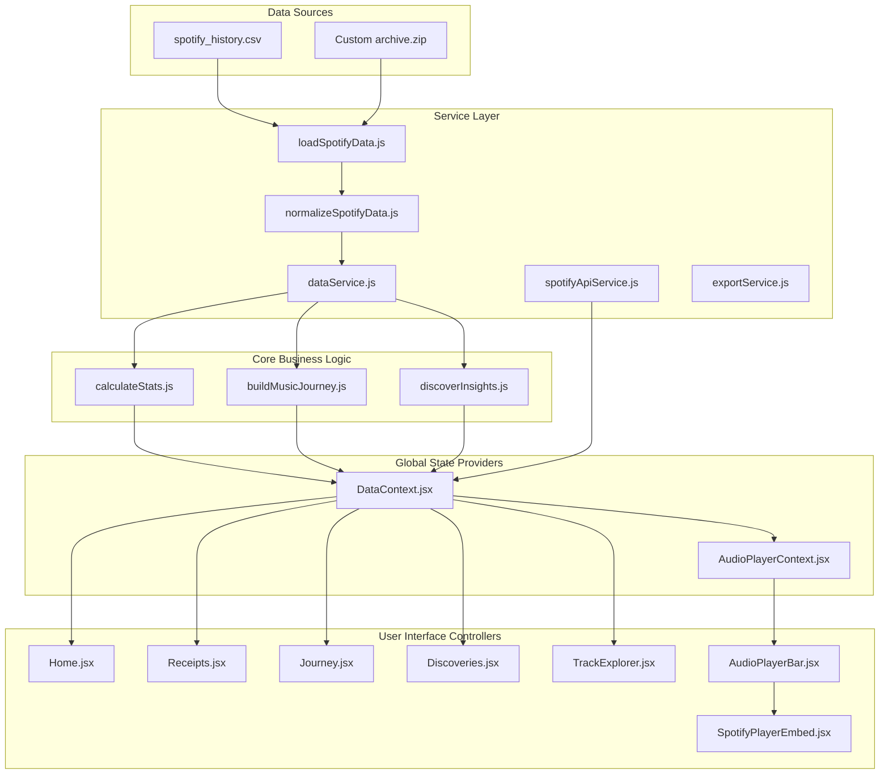

# 🏗️ ARCHITECTURE & DESIGN SPECIFICATION — LIFE//ARCHIVE

> **Comprehensive Architectural Blueprint, Service Layer Patterns, Data Pipeline, and Performance Specifications**

---

## 1. Executive Summary & Design Philosophy

`LIFE//ARCHIVE` is a client-side web application designed to compute and present deep analytical insights from 149,860 raw Spotify stream logs spanning 11 years (2013–2024).

### Key Architectural Pillars:
1. **Zero External AI & Zero Server Backend**: 100% of data loading, BOM removal, ISO date parsing, statistical calculations, era segmentation, and discovery detection execute in the browser.
2. **Unidirectional Data Flow (Flux / React Context Pattern)**: State changes propagate predictably down the component hierarchy from `DataContext` and `AudioPlayerContext`.
3. **Layered Service Architecture (`src/services/`)**: Separates raw data ingestion, statistical computation, export utilities, and Spotify API search queries into decoupled service modules.
4. **WCAG 2.1 AA Accessibility & Performance**: High contrast ratio, keyboard focus management, WAI-ARIA landmarks, and Vite code-splitting chunk optimizations.

---

## 2. High-Level Architectural Diagrams (C4 Model)

### Container Architecture Diagram

---

## 3. Layered Service Architecture Breakdown

### 📦 Ingestion & Normalization Layer
- **[`src/data/loadSpotifyData.js`](file:///c:/Users/hemal/OneDrive/Desktop/webrush/src/data/loadSpotifyData.js)**: Asynchronously fetches `/spotify_history.csv` using native `fetch` with candidate fallbacks, or decompresses uploaded Spotify `.zip` archives via `JSZip`.
- **[`src/data/normalizeSpotifyData.js`](file:///c:/Users/hemal/OneDrive/Desktop/webrush/src/data/normalizeSpotifyData.js)**: Strips UTF-8 Byte Order Marks (BOM `\uFEFF`), parses ISO 8601 timestamps, converts milliseconds to seconds/minutes, tags nocturnal streams (00:00-05:00), and sorts chronologically.

### 🧠 Analytics & Intelligence Layer
- **[`src/utils/calculateStats.js`](file:///c:/Users/hemal/OneDrive/Desktop/webrush/src/utils/calculateStats.js)**: Computes macro summary metrics (total plays, stream hours, unique artists/tracks, nocturnal percentage, shuffle & skip rates, top tracks/artists).
- **[`src/utils/buildMusicJourney.js`](file:///c:/Users/hemal/OneDrive/Desktop/webrush/src/utils/buildMusicJourney.js)**: Segments stream history into chronological chapters based on listening volume shifts and top artist transitions.
- **[`src/utils/discoverInsights.js`](file:///c:/Users/hemal/OneDrive/Desktop/webrush/src/utils/discoverInsights.js)**: Evaluates statistical distributions to produce substantiated discovery cards with supporting record sets.

### 🔌 Service & API Abstraction Layer
- **[`src/services/dataService.js`](file:///c:/Users/hemal/OneDrive/Desktop/webrush/src/services/dataService.js)**: Encapsulates async loading, normalization, and statistical computation into a single promise (`fetchAndProcessSpotifyData()`).
- **[`src/services/spotifyApiService.js`](file:///c:/Users/hemal/OneDrive/Desktop/webrush/src/services/spotifyApiService.js)**: Implements `querySongs(records, query, limit)` and `paginateSongs(records, query, batchSize)` producing Spotify GraphQL `searchV2.tracksV2.items` schema objects.
- **[`src/services/exportService.js`](file:///c:/Users/hemal/OneDrive/Desktop/webrush/src/services/exportService.js)**: Handles client-side JSON and Markdown export generation and browser file downloads.

---

## 4. State Management Specification

### `DataContext.jsx`
Maintains macro application state:
- `records`: Array of 149,860 normalized stream objects.
- `stats`: Calculated quantitative statistics.
- `eras`: Segmented chronological chapters.
- `insights`: Evidence-backed discovery array.
- `selectedRecord`: Active track selected for provenance detail drawer inspection.

### `AudioPlayerContext.jsx`
Maintains media playback & theme state:
- `currentTrack`: Active track object currently loaded into Spotify player.
- `trackList`: Current playlist queue.
- `isPlaying`: Playback state boolean.
- `isShuffle` / `isRepeat`: Playback mode flags.
- `likedTrackIds`: Array of favorited track IDs persisted in `localStorage`.
- `theme`: Active color theme (`'dark'` / `'light'`).

---

## 5. Performance & Optimization Architecture

1. **Vite Bundle Splitting**: `vite.config.js` configures vendor chunking (`vendor.js` and `index.js`) to ensure fast page loads and efficient browser caching.
2. **Component Memoization**: List items (`TrackCard.jsx`, `StatCard.jsx`, `InsightCard.jsx`) wrapped in `React.memo` to eliminate unnecessary DOM re-renders during high-frequency list interactions.
3. **iFrame Remounting Control**: `SpotifyPlayerEmbed.jsx` uses `key={cleanId}` on the Spotify iframe DOM element to force clean remounting and immediate song switching when changing tracks.
4. **Lazy Asset Rendering**: Heavy visualizers (`AcousticLedgerVisual.jsx`, `AudioVisualizer.jsx`) utilize HTML5 Canvas `requestAnimationFrame` for 60 FPS GPU-accelerated graphics.
