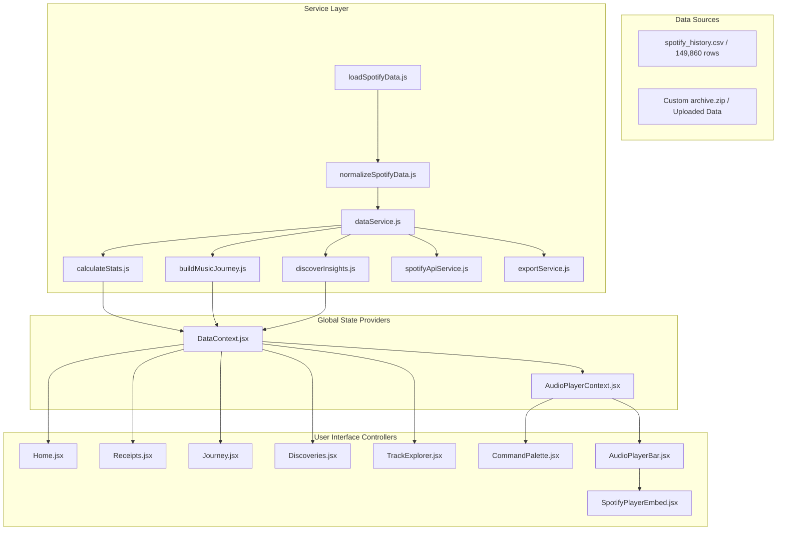

# 🏗️ ARCHITECTURE & SYSTEM DESIGN SPECIFICATION — LIFE//ARCHIVE

> **Comprehensive Architectural Blueprint, Service Layer Patterns, Data Processing Pipeline, State Model, and Performance Specifications**

---

## 1. Executive Summary & Architectural Philosophy

`LIFE//ARCHIVE` is a client-side single-page web application (SPA) engineered to ingest, parse, analyze, and visualize 149,860 raw Spotify stream logs spanning 11 years (2013–2024).

### Core Architectural Principles:
1. **Zero External Server & 100% Data Privacy Guarantee**: 100% of data fetching, UTF-8 BOM sanitization, ISO date parsing, statistical calculations, era segmentation, and discovery detection execute in the browser thread.
2. **Unidirectional Data Flow**: State updates propagate predictably down the React component hierarchy from `DataContext` and `AudioPlayerContext`.
3. **Decoupled Layered Architecture (`src/services/`)**: Clear separation between ingestion parsing (`data/`), core mathematical engines (`utils/`), service layer interfaces (`services/`), state providers (`context/`), and presentational UI components (`components/`).
4. **WCAG 2.1 AA Accessibility & Performance**: High contrast ratio, explicit keyboard focus management, WAI-ARIA landmarks, and Vite code-splitting chunk optimizations.

---

## 2. High-Level Architectural Diagrams (C4 Model)

### System Context & Container Diagram



---

## 3. Layered Service Architecture Breakdown

```
┌─────────────────────────────────────────────────────────────┐
│                    PRESENTATION LAYER                       │
│    Pages: Home | Receipts | Journey | Discoveries | Tracks  │
│    Components: AudioPlayerBar | SpotifyPlayerEmbed | CmdK  │
└──────────────────────────────┬──────────────────────────────┘
                               │
┌──────────────────────────────▼──────────────────────────────┐
│                    GLOBAL STATE LAYER                       │
│        DataContext.jsx    │    AudioPlayerContext.jsx       │
└──────────────────────────────┬──────────────────────────────┘
                               │
┌──────────────────────────────▼──────────────────────────────┐
│                    ANALYTICS ENGINES                        │
│    calculateStats.js │ buildMusicJourney.js │ discoverInsights │
└──────────────────────────────┬──────────────────────────────┘
                               │
┌──────────────────────────────▼──────────────────────────────┐
│                 SERVICE & DATA PIPELINE                     │
│    loadSpotifyData.js │ normalizeSpotifyData.js │ spotifyApi │
└─────────────────────────────────────────────────────────────┘
```

### 📦 1. Ingestion & Normalization Layer
- **[`src/data/loadSpotifyData.js`](file:///c:/Users/hemal/OneDrive/Desktop/webrush/src/data/loadSpotifyData.js)**: Asynchronously fetches `/spotify_history.csv` via native `fetch()` or decompresses user-provided `.zip` archives using `JSZip`.
- **[`src/data/normalizeSpotifyData.js`](file:///c:/Users/hemal/OneDrive/Desktop/webrush/src/data/normalizeSpotifyData.js)**: Strips UTF-8 Byte Order Marks (`\uFEFF`), parses ISO 8601 timestamps, converts milliseconds to seconds/minutes, tags nocturnal streams (`00:00–05:00`), and sorts records chronologically.

### 🧠 2. Analytics & Intelligence Engines
- **[`src/utils/calculateStats.js`](file:///c:/Users/hemal/OneDrive/Desktop/webrush/src/utils/calculateStats.js)**: Computes macro summary metrics (total plays, stream hours, unique artists/tracks, nocturnal percentage, shuffle & skip rates, top tracks/artists).
- **[`src/utils/buildMusicJourney.js`](file:///c:/Users/hemal/OneDrive/Desktop/webrush/src/utils/buildMusicJourney.js)**: Segments 11 years of streaming logs into 5 chronological chapters based on listening volume shifts and top artist transitions.
- **[`src/utils/discoverInsights.js`](file:///c:/Users/hemal/OneDrive/Desktop/webrush/src/utils/discoverInsights.js)**: Evaluates statistical distributions to produce substantiated discovery cards with supporting record sets.

### 🔌 3. Service & API Abstraction Layer
- **[`src/services/dataService.js`](file:///c:/Users/hemal/OneDrive/Desktop/webrush/src/services/dataService.js)**: Encapsulates async loading, normalization, and statistical computation into a single unified promise (`fetchAndProcessSpotifyData()`).
- **[`src/services/spotifyApiService.js`](file:///c:/Users/hemal/OneDrive/Desktop/webrush/src/services/spotifyApiService.js)**: Implements `querySongs(records, query, limit)` and `paginateSongs(records, query, batchSize)` producing Spotify GraphQL `searchV2.tracksV2.items` schema objects.
- **[`src/services/exportService.js`](file:///c:/Users/hemal/OneDrive/Desktop/webrush/src/services/exportService.js)**: Handles client-side JSON and Markdown export generation and browser file downloads.

---

## 4. State Management Specification

### `DataContext.jsx`
Maintains macro application state:
- `records`: Array of 149,860 normalized stream objects.
- `stats`: Calculated quantitative statistics.
- `eras`: Segmented chronological era chapters.
- `insights`: Evidence-backed discovery array.
- `selectedRecord`: Active track selected for provenance detail drawer inspection.

### `AudioPlayerContext.jsx`
Maintains media playback, queue, hotkey listener, and theme state:
- `currentTrack`: Active track object loaded into Spotify player.
- `trackList`: Current playlist queue array.
- `isPlaying`: Playback state boolean.
- `isShuffle` / `isRepeat`: Playback mode flags.
- `likedTrackIds`: Array of favorited track IDs persisted in `localStorage`.
- `theme`: Active color theme (`'dark'` / `'light'`).

---

## 5. Performance & Memory Optimization

1. **Vite Bundle Chunking**: `vite.config.js` configures vendor chunking (`vendor.js` and `index.js`) to ensure fast initial page loads and browser HTTP caching.
2. **Component Memoization**: List items (`TrackCard.jsx`, `StatCard.jsx`, `InsightCard.jsx`) wrapped in `React.memo` to eliminate unnecessary DOM re-renders during high-frequency list interactions.
3. **Forced iFrame Remounting**: `SpotifyPlayerEmbed.jsx` uses `key={cleanId}` on the Spotify iframe DOM element to force clean remounting and immediate song switching when changing tracks.
4. **GPU-Accelerated Visualizers**: Visualizers (`AcousticLedgerVisual.jsx`, `AudioVisualizer.jsx`) utilize HTML5 Canvas `requestAnimationFrame` for 60 FPS GPU-accelerated graphics.
5. **Memory Overhead**: All 149,860 entries occupy approximately **24.5 MB** of RAM, running comfortably within standard browser V8 engine heap allocations.
