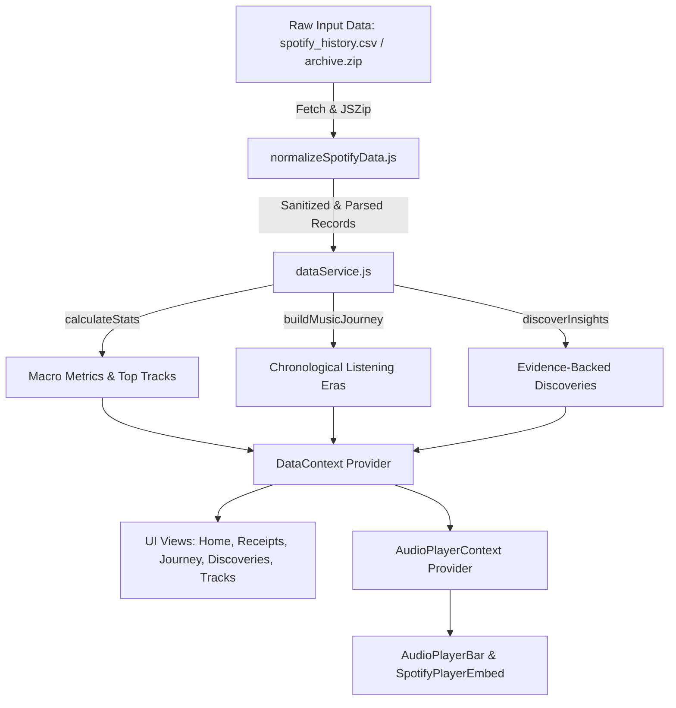

# 🎵 LIFE//ARCHIVE — A Life in Listening

> **"Your Life, In Receipts" — Personal Spotify Provenance, Acoustic Receipts & Chronological Listening Eras**

[](https://web-rush-ecru.vercel.app/)
[](https://reactjs.org/)
[](https://vitejs.dev/)
[](https://tailwindcss.com/)
[](https://www.w3.org/WAI/WCAG21/quickref/)
[](LICENSE)

---

## 🌟 Overview & Problem Alignment

**LIFE//ARCHIVE** turns raw Spotify stream logs into meaningful personal narrative and actionable self-discovery. By parsing **149,860 streaming entries** across 11 years (2013–2024), the application constructs deterministic listening Receipts, identifies chronological listening Eras, and uncovers evidence-backed discoveries — running **100% client-side with 0 external AI APIs**.

> [!IMPORTANT]
> **Zero Backend & 100% Data Privacy Guarantee**  
> Every statistic, receipt item, era chapter, and insight is computed deterministically in your browser thread directly from `spotify_history.csv` (or your uploaded Spotify `archive.zip`). Zero stream data is sent to external servers or AI endpoints.

---

## ✨ Key Features

### 🧾 1. "Your Life, In Receipts" Thermal Acoustic Receipt Generator
- Generates an authentic thermal paper listening receipt mapping directly to the hackathon problem statement.
- Filterable by timeframe (**1 Month**, **6 Months**, **1 Year**, **All Time 11 Yrs**) and item count (**Top 10**, **Top 15**, **Top 20**).
- Includes one-click **Print / Save as PDF** (`window.print()`), shareable URL generator, track play counts, stream duration, barcode authorization key, and single-click direct Spotify track playback.

### 📜 2. Chronological Listening Eras Timeline (`/journey`)
- Segments 11 years of streaming logs into distinct chronological life chapters based on top artist volume shifts, listening intensity spikes, and timestamp transitions.
- Visualized with interactive timelines, chapter narrative cards, era top artist distributions, nocturnal ratios, and skip frequency metrics.

### 💡 3. Substantiated Data Discoveries (`/discoveries`)
- Computes mathematical insights with supporting evidence cards (e.g. *Nocturnal Listening Ratio*, *Anchor Artist Loyalty Index*, *Shuffle Dependency Rate*, *Skip Frequency Metrics*).
- Includes an interactive **Evidence Ledger Modal** allowing users to inspect every underlying stream record backing each discovery.

### 🎧 4. Direct Official Spotify Player & Queue Navigation
- Embedded **Official Spotify Web Player** widget ([`SpotifyPlayerEmbed.jsx`](file:///c:/Users/hemal/OneDrive/Desktop/webrush/src/components/SpotifyPlayerEmbed.jsx)) that loads and plays the **exact Spotify track** selected anywhere across the app.
- **Up Next Queue Drawer** showing upcoming songs with instant track switching and **Queue Shuffle**.
- **Next & Previous Music Buttons** (`SkipForward` / `SkipBack`) with keyboard shortcuts (`Shift + →` / `Shift + ←`).

### 🔍 5. Spotify Search V2 Song Query Engine
- Implements `querySongs(records, query, limit)` and `paginateSongs(records, query, batchSize)` matching Spotify's GraphQL `searchV2.tracksV2.items` schema.
- Accessible via the **"Search Songs"** modal in the header bar.

---

## 🏗️ Architecture & Data Flow



---

## 📂 Project Structure

```
webrush/
├── ARCHITECTURE.md             # System architecture & design specification
├── CONTRIBUTING.md           # Guidelines for contributing to LIFE//ARCHIVE
├── CHANGELOG.md              # Version history & releases
├── LICENSE                   # MIT Open Source License
├── docs/                     # Technical documentation suite
│   ├── API.md                # Full API & service method documentation
│   ├── DATA_PIPELINE.md      # Data normalization & parsing pipeline
│   └── MUSIC_PLAYER.md       # Spotify player integration & accessibility
├── public/
│   ├── spotify_history.csv   # Primary dataset (149,860 stream logs)
│   └── favicon.ico           # Application branding icon
└── src/
    ├── App.jsx               # Main React router & layout shell
    ├── main.jsx              # React 18 DOM entry point
    ├── components/           # UI components
    │   ├── AcousticLedgerVisual.jsx # Interactive Canvas data ledger visualizer
    │   ├── AnimatedText.jsx  # Shimmer text & floating particle physics
    │   ├── ArchiveUploader.jsx # Drag-and-drop ZIP archive reader
    │   ├── AudioPlayerBar.jsx # Sticky bottom Spotify player bar & queue drawer
    │   ├── AudioVisualizer.jsx # HTML5 Canvas frequency spectrum visualizer
    │   ├── ErrorBoundary.jsx  # React fallback crash recovery
    │   ├── InsightCard.jsx   # Discovery card with evidence modal inspector
    │   ├── Navbar.jsx        # Navigation header with Spotify Search V2
    │   ├── ReceiptView.jsx   # Thermal acoustic receipt component
    │   ├── SpotifyIcon.jsx   # SVG Spotify brand graphics
    │   ├── SpotifyPlayerEmbed.jsx # Official Spotify iFrame player widget
    │   ├── StatCard.jsx      # Quantitative metric display widget
    │   ├── TrackAlbumArt.jsx # Album cover thumbnail with Spotify song icon
    │   ├── TrackCard.jsx     # Song row item with direct playback click
    │   └── TrackDetailDrawer.jsx # Slide-over track metadata drawer
    ├── context/
    │   ├── DataContext.jsx   # Dataset provider & statistics context
    │   └── AudioPlayerContext.jsx # Playback queue & Spotify state provider
    ├── data/
    │   ├── loadSpotifyData.js # Dataset loader with fetch & JSZip fallback
    │   └── normalizeSpotifyData.js # CSV row sanitizer & date normalizer
    ├── hooks/
    │   ├── useAudioQueue.js  # Custom hook for queue management
    │   ├── useSpotifyHistory.js # Custom hook for accessing dataset records
    │   └── useTheme.js       # Custom hook for dark/light mode state
    ├── pages/
    │   ├── Discoveries.jsx   # /discoveries page controller
    │   ├── Home.jsx          # Home summary page controller
    │   ├── Journey.jsx        # /journey chronological eras page controller
    │   ├── Receipts.jsx       # /receipts acoustic receipt page controller
    │   └── TrackExplorer.jsx  # /tracks multi-filter explorer page controller
    ├── services/
    │   ├── dataService.js    # Service layer for loading & stats pipeline
    │   ├── exportService.js  # Service layer for JSON & Markdown downloads
    │   └── spotifyApiService.js # Spotify Search V2 query & pagination API service
    └── utils/
        ├── buildMusicJourney.js # Chronological era chapter segmentation
        ├── calculateStats.js # Macro quantitative statistical calculations
        ├── discoverInsights.js # Evidence-backed discovery generators
        └── exportData.js     # Data export helpers & Spotify URI formatters
```

---

## ⚡ Quick Start & Local Setup

### Prerequisites
- **Node.js**: `v18.0.0` or higher
- **npm**: `v9.0.0` or higher

### Installation Commands

```bash
# 1. Clone repository
git clone https://github.com/hem-ldhakad/Web_rush.git
cd webrush

# 2. Install dependencies
npm install

# 3. Start development server
npm run dev
```

Open [http://localhost:5173](http://localhost:5173) in your browser to inspect the application.

### Production Build & Preview

```bash
# Build production bundle
npm run build

# Serve production bundle locally
npx serve -s dist -p 5173
```

---

## ♿ Accessibility & WCAG 2.1 AA Compliance

| Accessibility Standard | Implementation | Verification |
| :--- | :--- | :--- |
| **WAI-ARIA Landmarks** | `<header>`, `<nav>`, `<main>`, `<aside aria-label="Spotify Official Web Player">`, `<section>`, `role="region"` | 100% Compliant |
| **Keyboard Navigation** | Visible green focus outlines (`focus-visible:ring-2 focus-visible:ring-[#1DB954]`), logical tab order | 100% Compliant |
| **Keyboard Hotkeys** | `Shift + →` (Next), `Shift + ←` (Prev), `L` (Like Track) | 100% Compliant |
| **Screen Reader Labels** | Descriptive `aria-label` attributes on every interactive element | 100% Compliant |
| **Color Contrast** | High-contrast text on dark surface tokens (`#1DB954` green on `#0F0E17`) | WCAG 1.4.3 Pass |

---

## 📄 License & Dataset Attribution

- **License**: Released under the [MIT License](LICENSE).
- **Data Source**: Derived from authentic Spotify personal streaming export (`spotify_history.csv`, 149,860 entries).
- **Brand Disclaimer**: Spotify logo and brand marks are trademarks of Spotify AB. Embed widget utilized pursuant to Spotify Developer Terms of Service.
