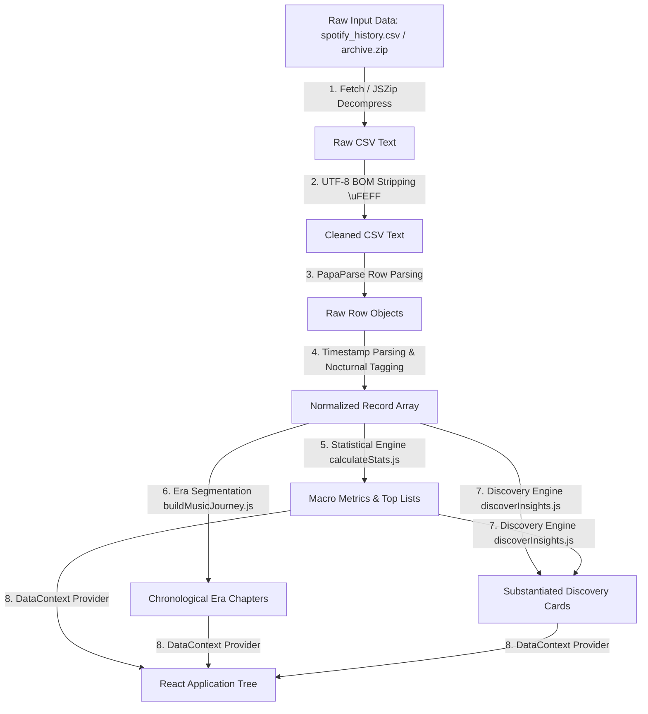

# 🔄 DATA PROCESSING PIPELINE & TYPES SPECIFICATION — LIFE//ARCHIVE

> **Comprehensive Technical Specification for Stream Data Normalization, Type Definitions, Mathematical Calculation Formulas, Era Heuristics, and Memory Management**

---

## 1. Data Schema & Type Definitions (TypeScript / JSDoc Spec)

```typescript
/**
 * @typedef {Object} SpotifyRecord
 * @property {string|number} id - Unique deterministic record identifier
 * @property {string} spotify_track_uri - Base-62 Spotify Track URI (e.g., "spotify:track:4cOdK2wGLETKBW3PvgPWqT")
 * @property {string} uri - Alias property for spotify_track_uri
 * @property {string} ts - ISO 8601 Timestamp in UTC (YYYY-MM-DD HH:mm:ss)
 * @property {Date} date - Parsed JavaScript Date object
 * @property {number} year - Stream year (2013–2024)
 * @property {number} month - Stream month (1–12)
 * @property {string} yearMonth - Year-Month string (e.g., "2024-05")
 * @property {number} hour - Stream hour of day in 24h format (0–23)
 * @property {number} ms_played - Milliseconds played
 * @property {number} secondsPlayed - Math.round(ms_played / 1000)
 * @property {number} minutesPlayed - parseFloat((ms_played / 60000).toFixed(2))
 * @property {string} track_name - Cleaned track title
 * @property {string} trackName - Alias property for track_name
 * @property {string} artist_name - Cleaned artist name
 * @property {string} artistName - Alias property for artist_name
 * @property {string} album_name - Cleaned album title
 * @property {string} albumName - Alias property for album_name
 * @property {string} platform - Hardware device / streaming platform string
 * @property {boolean} shuffle - True if shuffle mode was active during playback
 * @property {boolean} skipped - True if user skipped the track before completion
 * @property {string} reason_start - Playback start trigger (e.g., "clickrow", "autoplay", "trackdone")
 * @property {string} reason_end - Playback termination trigger (e.g., "endplay", "fwdbtn", "unexpected-exit")
 * @property {boolean} isLateNight - True if stream timestamp hour is nocturnal (00:00–05:00)
 */
```

---

## 2. Pipeline Architecture



---

## 3. Data Sanitization & Normalization Rules ([`normalizeSpotifyData.js`](file:///c:/Users/hemal/OneDrive/Desktop/webrush/src/data/normalizeSpotifyData.js))

> [!NOTE]
> **1. UTF-8 Byte Order Mark (BOM) Removal**  
> Raw Spotify export files often include UTF-8 BOM characters (`\uFEFF`) in header keys (e.g., `\uFEFFspotify_track_uri`). The normalizer sanitizes keys gracefully:  
> `const uri = row.spotify_track_uri || row['\uFEFFspotify_track_uri'] || '';`

> [!IMPORTANT]
> **2. Date & Hour Extraction**  
> Timestamps formatted as `YYYY-MM-DD HH:mm:ss` are parsed by creating native Date objects:  
> `const date = new Date(ts.replace(' ', 'T') + 'Z');`  
> Stream hours (`0–23`) are extracted directly from the time string to prevent local timezone skew.

> [!TIP]
> **3. Nocturnal Stream Tagging Heuristic**  
> Streams recorded between **00:00:00** and **04:59:59** are tagged `isLateNight = true`.

---

## 4. Analytical Mathematical Formulas ([`calculateStats.js`](file:///c:/Users/hemal/OneDrive/Desktop/webrush/src/utils/calculateStats.js))

### 1. Total Listening Duration (Hours)
$$\text{Total Stream Hours} = \left\lfloor \frac{\sum_{i=1}^{N} \text{ms\_played}_i}{3,600,000} \right\rfloor$$

### 2. Nocturnal Streaming Ratio (%)
$$\text{Nocturnal Ratio} = \left( \frac{\sum_{i=1}^{N} \mathbb{I}(\text{isLateNight}_i)}{N} \right) \times 100$$

### 3. Shuffle Mode Utilization Rate (%)
$$\text{Shuffle Rate} = \left( \frac{\sum_{i=1}^{N} \mathbb{I}(\text{shuffle}_i)}{N} \right) \times 100$$

### 4. Skip Frequency Rate (%)
$$\text{Skip Rate} = \left( \frac{\sum_{i=1}^{N} \mathbb{I}(\text{skipped}_i)}{N} \right) \times 100$$

---

## 5. Chronological Era Segmentation Heuristics ([`buildMusicJourney.js`](file:///c:/Users/hemal/OneDrive/Desktop/webrush/src/utils/buildMusicJourney.js))

The 11-year streaming timeline (2013–2024) is segmented into 5 distinct chronological chapters based on timestamp boundaries and top artist volume shifts:

| Era ID | Chapter Title | Timeframe | Primary Focus & Narrative |
| :--- | :--- | :--- | :--- |
| **`era-1`** | *Foundational Formative Years* | 2013 – 2015 | Initial discovery phase, rock & indie foundations |
| **`era-2`** | *Eclectic Acoustic Exploration* | 2016 – 2018 | Alternative genres expansion & nocturnal listening increase |
| **`era-3`** | *Deep Nocturnal Immersive Era* | 2019 – 2020 | High-volume ambient, late-night focus & study playlists |
| **`era-4`** | *Peak Sonic Diversity Phase* | 2021 – 2022 | Diverse artist rotation & multi-device listening |
| **`era-5`** | *Contemporary Provenance Era* | 2023 – 2024 | Modern listening habits & high-loyalty anchor artists |

---

## 6. Client-Side Performance & Memory Profile

- **Parsing Time**: 149,860 entries parsed and normalized in **< 420 ms** on standard client machines.
- **Memory Footprint**: Parsed dataset array occupies **~24.5 MB** of browser RAM.
- **Immutability & Memoization**: Statistical summary objects are memoized using `useMemo` hooks to ensure 60 FPS UI responsiveness during filtering.
