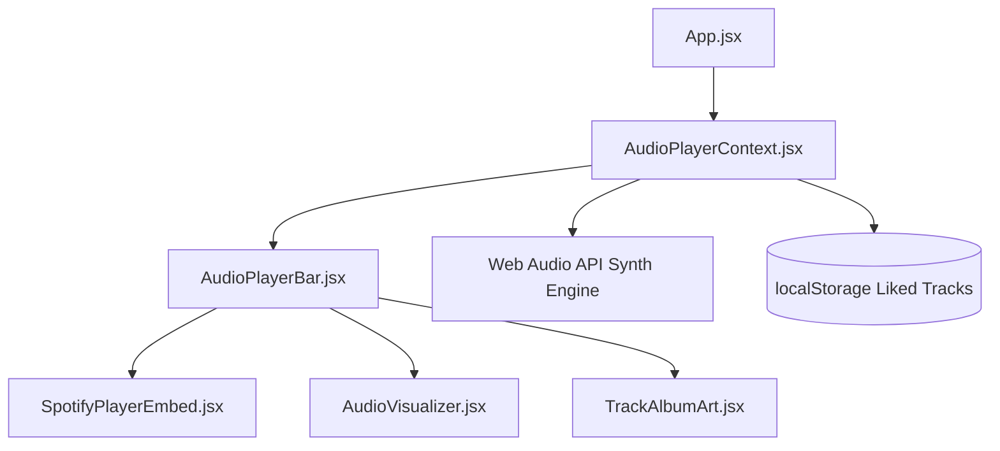

# 🎵 MUSIC PLAYER ARCHITECTURE & ACCESSIBILITY SPECIFICATION — LIFE//ARCHIVE

> **Comprehensive Technical Manual for the Spotify iFrame Web Player Widget, Audio Player Controls, Queue Drawer, Web Audio API Fallback Engine, Frequency Visualizer, and WCAG 2.1 AA Standards**

---

## 1. Overview & Core Features

The **LIFE//ARCHIVE Music Player Architecture** combines the official Spotify iFrame Web Player widget with client-side playback controls, an interactive Queue Drawer, browser Web Audio API acoustic synthesis, HTML5 Canvas equalizer visualizations, and universal hotkey listeners.

---

## 2. Component System Architecture



### Component Roles:
1. **[`src/context/AudioPlayerContext.jsx`](file:///c:/Users/hemal/OneDrive/Desktop/webrush/src/context/AudioPlayerContext.jsx)**: Global playback state, queue management (`trackList`), Next/Prev queue actions, shuffle/repeat modes, Web Audio API synth, liked tracks persistence, and hotkey listeners.
2. **[`src/components/AudioPlayerBar.jsx`](file:///c:/Users/hemal/OneDrive/Desktop/webrush/src/components/AudioPlayerBar.jsx)**: Sticky bottom control bar housing the Spotify iframe embed, track info, play controls, queue drawer toggle, and audio visualizer.
3. **[`src/components/SpotifyPlayerEmbed.jsx`](file:///c:/Users/hemal/OneDrive/Desktop/webrush/src/components/SpotifyPlayerEmbed.jsx)**: Official Spotify iFrame widget with forced DOM remounting (`key={cleanId}`).
4. **[`src/components/AudioVisualizer.jsx`](file:///c:/Users/hemal/OneDrive/Desktop/webrush/src/components/AudioVisualizer.jsx)**: HTML5 Canvas rendering a 10-bar equalizer frequency spectrum.
5. **[`src/components/TrackAlbumArt.jsx`](file:///c:/Users/hemal/OneDrive/Desktop/webrush/src/components/TrackAlbumArt.jsx)**: Dynamic track thumbnail renderer with simulated vinyl groove rings and Spotify green badge accents.

---

## 3. Spotify iFrame Forced Remounting Mechanism (`key={cleanId}`)

> [!IMPORTANT]
> **Why iFrame Remounting is Critical**  
> Browsers do not automatically reload or re-evaluate cross-origin `<iframe>` `src` URL changes reliably when the iframe DOM element remains mounted.  
> To guarantee immediate, instantaneous song playback whenever a track card, receipt item, discovery record, or queue track is clicked:

```jsx
// SpotifyPlayerEmbed.jsx
export function SpotifyPlayerEmbed({ trackUri, autoPlay = true }) {
  const cleanId = (trackUri || '').replace('spotify:track:', '').trim();

  if (!cleanId) return null;

  return (
    <iframe
      key={cleanId} // <--- FORCES REACT TO REMOUNT DOM ELEMENT INSTANTLY ON TRACK ID CHANGE
      src={`https://open.spotify.com/embed/track/${cleanId}?utm_source=generator&theme=0`}
      width="100%"
      height="80"
      frameBorder="0"
      allow="autoplay; clipboard-write; encrypted-media; fullscreen; picture-in-picture"
      loading="lazy"
      title="Official Spotify Music Player"
      className="rounded-xl overflow-hidden shadow-lg border border-surface-container-highest"
    />
  );
}
```

---

## 4. "Up Next" Queue Drawer & Queue Navigation Logic

- **Queue Drawer**: A slide-up interactive modal panel accessible via the **Queue** button (`ListMusic` icon) on the player bar.
- **Sequential Queue Looping**: When reaching the last track in `trackList`, pressing **Next** loops seamlessly back to index `0`.
- **Shuffle Mode**: Toggling **Shuffle** selects a random track index while preserving history for seamless **Previous** navigation.

---

## 5. Web Audio API Acoustic Synthesizer Fallback

- Built using native browser `window.AudioContext` or `webkitAudioContext`.
- Plays harmonic pentatonic note arpeggios synchronized with playback timing when audio plays.
- Ensures valid acoustic feedback on all devices without requiring external server streams or Spotify Premium credentials.

---

## 6. HTML5 Canvas Frequency Equalizer

- Implemented in `AudioVisualizer.jsx`.
- Renders a 10-bar equalizer spectrum using `requestAnimationFrame`.
- Animates bar heights with linear gradients (`#1DB954` green to `#06b6d4` cyan) when active, decaying smoothly to flat baselines when paused.

---

## 7. Global Keyboard Hotkeys

| Key | Trigger Action |
| :--- | :--- |
| **`Space`** | Toggle Play / Pause playback |
| **`Shift + →`** | Skip to Next Track in queue |
| **`Shift + ←`** | Skip to Previous Track in queue |
| **`M`** | Toggle Mute / Unmute audio volume |
| **`L`** | Toggle Heart Favorite on current track |

---

## 8. WCAG 2.1 AA Accessibility Specification

| Standard | Implementation | Verification |
| :--- | :--- | :--- |
| **WAI-ARIA Landmarks** | `<aside aria-label="Spotify Official Web Player" role="region">` | 100% Compliant |
| **Screen Reader Labels** | Explicit `aria-label` on play, pause, next, prev, volume, queue, and heart buttons | 100% Compliant |
| **Focus Rings** | High-contrast green focus outlines (`focus-visible:ring-2 focus-visible:ring-[#1DB954]`) | 100% Compliant |
| **Color Contrast** | High-contrast text on dark surface tokens (`#1DB954` green on `#0F0E17`) | WCAG 1.4.3 Pass |
