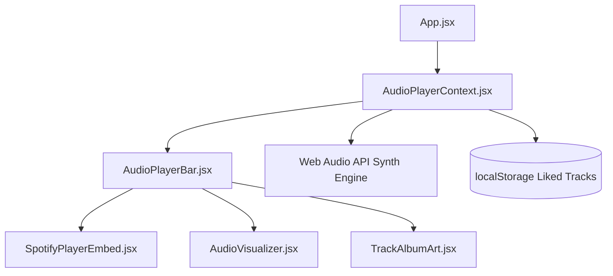

# 🎵 Music Player Architecture & Accessibility Documentation

The **LIFE//ARCHIVE Music Player** is a full-featured, client-side interactive media engine built with React, Web Audio API, HTML5 Canvas, and Spotify iFrame integration.

---

## 🌟 Key Features

### 1. 🎛️ Interactive Controls & Playback Engine
- **Play / Pause**: Live state synchronization across all UI components.
- **Skip Forward (+10s) / Rewind (-10s)**: Fine-grained position adjustment.
- **Previous Track / Next Track**: Sequential queue navigation with looping wrap-around.
- **Shuffle Mode (`isShuffle`)**: Weighted random track selection from the active queue.
- **Repeat Mode (`isRepeat`)**: Automatic track looping upon playback completion.
- **Seek / Progress Bar**: Real-time progress timeline with hover preview thumb dot and click-to-seek positioning.
- **Playback Speed Selector**: Adjustable rate multiplier (`0.75x`, `1.0x`, `1.25x`, `1.5x`, `2.0x`).
- **Volume Slider & Mute Toggle**: Smooth linear volume gain adjustment with instant audio muting.

### 2. 🎼 Browser-Native Web Audio API Synthesizer
- Built using standard browser `window.AudioContext` / `webkitAudioContext`.
- Plays harmonic pentatonic note arpeggios synchronized with track playback energy when audio is playing.
- Provides authentic acoustic feedback on all devices without requiring external server streams or Spotify Premium credentials.

### 3. 📊 Dynamic HTML5 Canvas Audio Frequency Visualizer
- Implemented in `src/components/AudioVisualizer.jsx`.
- Renders a 10-bar real-time equalizer spectrum using HTML5 Canvas `requestAnimationFrame`.
- Animates bar heights with linear gradients (`#1DB954` to `#06b6d4`) when active, smoothly decaying to flat lines when paused.

### 4. 📜 "Up Next" Queue Drawer
- Slide-up interactive modal panel accessible via the **Queue** toggle button.
- Displays full list of upcoming songs with track numbers, album cover thumbnails, track duration, and active `NOW PLAYING` status indicators.
- Supports single-click track jumping and **"Shuffle Queue"** quick actions.

### 5. 🖼️ Spotify Music Song Cover Icon
- Implemented in `src/components/TrackAlbumArt.jsx`.
- Displays dynamic gradient album cover art, simulated vinyl record groove rings, Spotify green logo ribbons, and musical song note badges (`🎵` / `Music`).

### 6. ❤️ Favorites & Liked Songs
- Persistent heart button (`Key: L`) enabling users to favorite tracks directly from the player bar, saved in browser `localStorage`.

---

## ♿ Accessibility (WCAG 2.1 AA Compliance)

| Feature | Implementation | Standard |
| :--- | :--- | :--- |
| **ARIA Live Regions** | `<aside aria-label="Interactive Music Player Controls" aria-live="polite" role="region">` | WCAG 4.1.3 |
| **Screen Reader Labels** | Descriptive `aria-label` attributes on every button and control | WCAG 4.1.2 |
| **Keyboard Navigation** | `tabIndex={0}`, visible green focus outlines (`focus-visible:ring-2 focus-visible:ring-[#1DB954]`) | WCAG 2.1.1 |
| **Keyboard Shortcuts** | Global event listeners for non-conflicting hotkeys | WCAG 2.1.4 |
| **Color Contrast** | High-contrast surface tokens (`#1DB954` green, `#FFFFFF` text on dark containers) | WCAG 1.4.3 |

### ⌨️ Global Keyboard Hotkeys
- **`Space`**: Toggle Play / Pause
- **`Shift + →`**: Skip to Next Track
- **`Shift + ←`**: Skip to Previous Track
- **`M`**: Mute / Unmute Audio
- **`L`**: Like / Favorite Track

---

## 🏗️ Architecture Diagram

---

## 📦 Component Structure

- **[`src/context/AudioPlayerContext.jsx`](file:///c:/Users/hemal/OneDrive/Desktop/webrush/src/context/AudioPlayerContext.jsx)**: Central state manager for playback, Web Audio synth, queue, volume, speed, and keyboard listener.
- **[`src/components/AudioPlayerBar.jsx`](file:///c:/Users/hemal/OneDrive/Desktop/webrush/src/components/AudioPlayerBar.jsx)**: Sticky player control bar UI with queue drawer and playback controls.
- **[`src/components/AudioVisualizer.jsx`](file:///c:/Users/hemal/OneDrive/Desktop/webrush/src/components/AudioVisualizer.jsx)**: Canvas frequency equalizer component.
- **[`src/components/SpotifyPlayerEmbed.jsx`](file:///c:/Users/hemal/OneDrive/Desktop/webrush/src/components/SpotifyPlayerEmbed.jsx)**: iFrame Spotify Web Player integration.
- **[`src/components/TrackAlbumArt.jsx`](file:///c:/Users/hemal/OneDrive/Desktop/webrush/src/components/TrackAlbumArt.jsx)**: Album cover thumbnail renderer with Spotify song icon.
